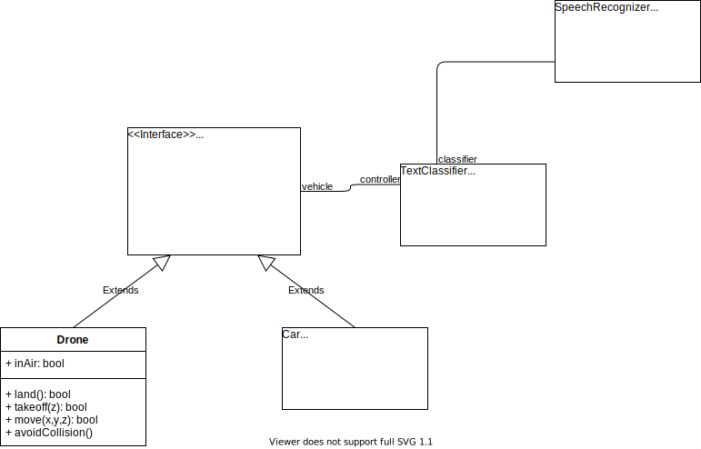

# AI@motion

## General

5th May - 31st of July

End of june and beginnign of july will be mostly dediated to the exams.

--> very short timespan

--> Use as much pre existing libs /pretrained models etc. as possible
--> Fuck over great test etc..

Focus on time saving / getting to smth. we can present at the end

End of may will be a short talk with the profs, we should have atleast a plan by then, aswell as some basic code structure.

## Problem Overview

Hypothetical "Mobibox" takes commands in natural speech, executes them in airsim.
Transform natural speech to text, classify text into commands, execute commands while avoiding obstacles, staying on road etc...

